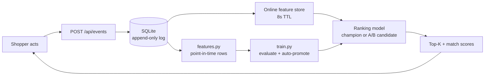

<div align="center">

# recsys-lite

**An end-to-end product recommender you can run on a laptop — and a console that shows you exactly how it works.**

[](.github/workflows/ci.yml)
[](LICENSE)
[](https://www.python.org/)
[](tests/)
[](Dockerfile)

[Quickstart](#quickstart) · [What it does](#what-it-does) · [Documentation](#documentation) · [Known limitations](#known-limitations)

</div>

---

## What it does

recsys-lite captures shopper behaviour, turns it into point-in-time features,
trains a sequence ranking model, and serves personalised recommendations —
with A/B routing, a model registry, drift monitoring and Prometheus metrics.

**Kestrel**, the web console, is one application shell with two halves:

| | |
|---|---|
| **Shop** | Storefront, catalog, product pages, cart, checkout |
| **Operations** | Live KPIs, model registry, drift monitor, raw event stream |

They share a shell on purpose: every number on the Operations side is produced
by the shopping on the Shop side. Add something to a cart, watch the row land
in the event stream, wait out the feature-store TTL, and the recommendations
move. Nothing is mocked to simulate it.



### What it is not

A deliberately narrow **vertical slice**, not a production platform. One
process, one SQLite file, no broker, no orchestrator, no separate inference
server. The full substitution table is in
[docs/ARCHITECTURE.md](docs/ARCHITECTURE.md#what-stands-in-for-what).

---

## Quickstart

```powershell
.\scripts\run_demo.ps1      # Windows
```
```bash
./scripts/run_demo.sh       # macOS / Linux
```

Creates a venv, installs, generates data, trains a model, and serves
<http://127.0.0.1:8000>.

<details>
<summary>Step by step instead</summary>

```bash
python -m venv .venv && source .venv/bin/activate   # Windows: .venv\Scripts\activate
pip install -e ".[dev]"

python -m recsys_lite.generator --items 800 --users 2000   # -> data/recsys_lite.db
python -m recsys_lite.features                             # -> training_examples.jsonl
python -m recsys_lite.train --epochs 6                     # -> models/v1, promoted

python -m uvicorn recsys_lite.serving.app:app --reload
```
</details>

<details>
<summary>Docker</summary>

```bash
docker build -t recsys-lite .
docker run --rm -p 8000:8000 \
  -v recsys-lite-data:/app/data -v recsys-lite-models:/app/models \
  recsys-lite
```

First run with an empty volume bootstraps data and trains a model before
serving. Verified end-to-end on Docker Engine 29.7.2; final image **1.49 GB**,
running as `uid=1000(appuser)`. See [docs/DEPLOYMENT.md](docs/DEPLOYMENT.md).
</details>

### Try the loop

1. Open <http://127.0.0.1:8000>, pick a shopper in the sidebar
2. Open a product, add it to the cart
3. Go to **Operations → Event stream** and see your rows
4. Wait ~9s, return to the storefront — the recommendations have moved
5. Check out; **Operations → Overview** shows the purchase count rise

---

## Features

**Data & features**
- Synthetic generator with per-shopper category preference and activity skew
- Point-in-time feature builder — a training row's history contains only
  events strictly before the one that produced it
- Configurable **hard negative sampling** (same-category near-misses)

**Model**
- `nn.TransformerEncoder` ranking model; the candidate item is appended to the
  behaviour sequence and self-attention relates them
- Temporal train/val/test split — never random
- ROC-AUC, NDCG@K, HitRate@K in plain numpy
- Native cold-start handling via `src_key_padding_mask`

**Serving**
- FastAPI, 15 endpoints, OpenAPI at `/docs`
- Sticky A/B routing between champion and candidate
- File-backed model registry with automatic promotion on validation NDCG@5
- PSI drift detection
- Prometheus metrics at `/metrics`

**Console**
- Zero-build frontend: plain HTML, CSS and ES modules — no bundler, no
  `node_modules`, no runtime dependency
- **WebGL 3D hero**, hand-written (no Three.js): instanced quads with depth
  fog and pointer parallax, one draw call, disposed on navigation, and a
  single static frame under `prefers-reduced-motion`
- **Inter**, self-hosted as unicode-range subsets — professional typography
  with zero network egress
- Light and dark themes, all 20 colour pairs measured at WCAG AA
- Generated SVG artwork for every product
- Responsive to 375px, keyboard navigable, screen-reader labelled

---

## Measured results

Real numbers from real runs, not estimates.

### Hard negatives change the picture

Two runs on the same 800-item / 2,000-shopper dataset, identical except for
the sampling mode:

| Epoch | val AUC (uniform negatives) | val AUC (50% hard negatives) |
|---|---|---|
| 1 | 0.5730 | 0.5360 |
| 3 | 0.9495 | **0.8066** |
| 6 | 0.9988 | 0.9973 |

Epoch 3 drops from 0.95 to 0.81 — which is the point. The easy version was
flattering the model. Both still reach ~0.99 by epoch 6 because the catalog is
small (800 items over 24 categories) relative to the training data generated;
that ceiling is a property of the synthetic dataset's scale, stated rather
than hidden.

### A/B routing

100 shoppers at `RECSYS_LITE_AB_CANDIDATE_WEIGHT=30` → **69 champion / 31
candidate**. Assignment is a stable hash, so the same shopper always gets the
same variant.

### Docker image

**8.03 GB → 1.49 GB (−82%)**. PyPI's default Linux `torch` wheel bundles the
entire CUDA runtime — ~6.5 GB of GPU libraries a CPU-only container can never
use. Installing torch from the CPU index first fixes it.

### Accessibility

Contrast **measured in the browser**, not eyeballed. All 20 foreground/background
pairs clear WCAG AA in both themes; the full table is in
[docs/DESIGN-SYSTEM.md](docs/DESIGN-SYSTEM.md#contrast--measured). Measuring
caught two genuine failures that review had missed.

---

## Documentation

| Document | What's in it |
|---|---|
| [ARCHITECTURE.md](docs/ARCHITECTURE.md) | System shape, components, offline/online paths, data model, design trade-offs |
| [BUSINESS-FLOW.md](docs/BUSINESS-FLOW.md) | Eight end-to-end flows with sequence diagrams, event semantics |
| [API.md](docs/API.md) | All 15 endpoints with payloads and error behaviour |
| [DESIGN-SYSTEM.md](docs/DESIGN-SYSTEM.md) | Tokens, measured contrast, icons, artwork, a11y checklist |
| [DEVELOPMENT.md](docs/DEVELOPMENT.md) | Setup, CLIs, config, testing, frontend conventions, troubleshooting |
| [DEPLOYMENT.md](docs/DEPLOYMENT.md) | Docker, systemd, reverse proxy, backup, sizing, production gaps |
| [THIRD_PARTY.md](THIRD_PARTY.md) | Outside material and how it was used |
| [SECURITY.md](SECURITY.md) | Threat model, reporting, what is and isn't in scope |
| [CONTRIBUTING.md](CONTRIBUTING.md) | Definition of done, conventions, scope boundaries |

---

## Testing

```bash
pytest tests -q     # 55 passed
```

`tests/conftest.py` runs a **real** generate → features → train → serve cycle
once per session, so API tests exercise a genuinely trained model rather than
a mock.

Highlights of what is asserted:

- A training row's history never contains the event that produced it
- Hard negatives stay inside the positive's category
- The model survives an all-padding cold-start sequence without NaN
- PSI is 0 for identical distributions and `significant` for a constructed shift
- A/B assignment is sticky and splits at the configured ratio
- `/api/events/batch` **rolls the whole order back** if any line is invalid

CI runs on Ubuntu and Windows across Python 3.11 and 3.12, plus a smoke test
that boots the real server.

---

## Known limitations

Stated plainly, because finding them in production is worse.

**Cold-start scores are not calibrated against warm scores.** A shopper with
no history gets scores near **0.99**; a shopper with history gets scores near
**0.08**. Ordering *within* each case is meaningful, but the two are **not
comparable** — do not threshold on raw score. Cause: `features.py` requires
`min_history=1`, so no all-padding sequence ever appears in training. Fix
would be to include a share of empty-history rows, or calibrate the cold-start
branch separately.

**The AUC ceiling is a dataset property.** 800 items over 24 categories with
strong per-shopper preference is a learnable problem. Do not read ~0.99 as
evidence the architecture would hold up on real traffic.

**"Similar products" is not ML.** It is same-category, nearest-price. The
model scores shopper → item and has no item→item notion; the UI says so.

**Single writer.** SQLite serialises writes and the online store is
in-process, so multiple workers would disagree with each other. Run one.

**No authentication anywhere.** Anyone who can reach the port can read
everything and write events for any shopper. Deliberate for a demo —
[SECURITY.md](SECURITY.md) explains how to put it behind something.

**Drift is on-demand.** There is no scheduler; `/api/drift` computes when asked.

---

## Project layout

```
src/recsys_lite/     generator · features · model · train · registry · drift · serving/
web/                 Kestrel console — index.html · style.css · app.js
                     icons.js · illustrations.js · hero3d.js · fonts/
tests/               55 tests, real end-to-end fixture
docs/                six documents, see the table above
scripts/             run_demo · train_candidate · docker-entrypoint
.github/             CI, issue and PR templates, dependabot
Dockerfile           self-bootstrapping single-container image
```

---

## Acknowledgements

- **UI/UX rules** — [ui-ux-pro-max-skill](https://github.com/nextlevelbuilder/ui-ux-pro-max-skill)
  (MIT © Next Level Builder). Its rule set drove the console design and audit,
  and its Three.js guidance shaped the WebGL hero. No code vendored; see
  [THIRD_PARTY.md](THIRD_PARTY.md) for the rule-by-rule mapping.
- **Inter** by Rasmus Andersson ([SIL OFL 1.1](web/fonts/LICENSE-Inter.txt)),
  self-hosted as unmodified unicode-range subsets.
- **Model concept** — [Behavior Sequence Transformer for E-commerce
  Recommendation in Alibaba](https://arxiv.org/abs/1905.06874), Chen et al.,
  2019. The published *idea*; the implementation here is original and built on
  PyTorch's stock encoder.
- **Repository structure** — informed by
  [Consulting-crm-system](https://github.com/Ductri2006/Consulting-crm-system)
  (MIT), as an example of a well-organised open-source project layout.

---

## License

[MIT](LICENSE) © 2026 baoduynguyen1612

All Python and JavaScript in this repository is original work. Outside
material that influenced it is documented in [THIRD_PARTY.md](THIRD_PARTY.md).
