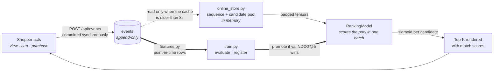
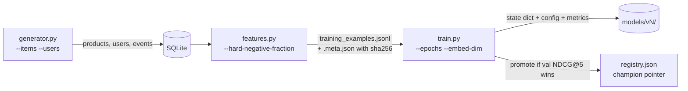
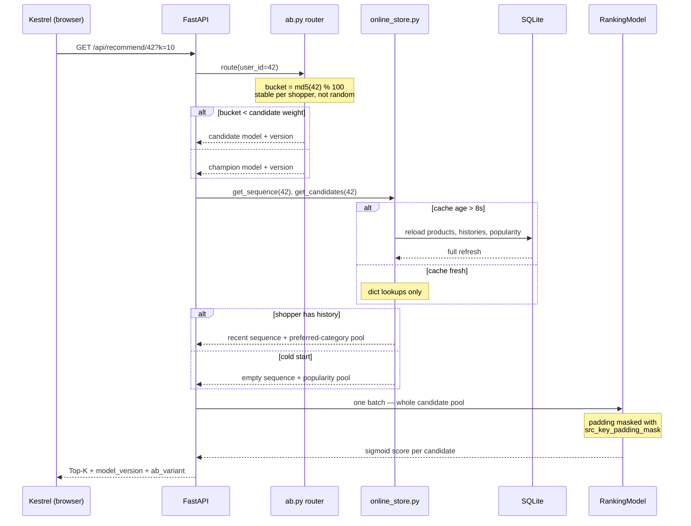
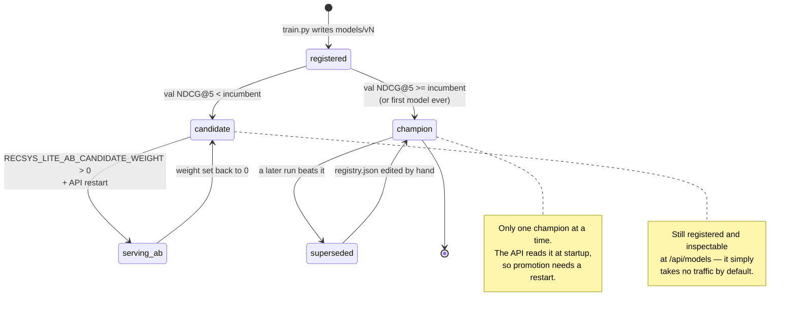
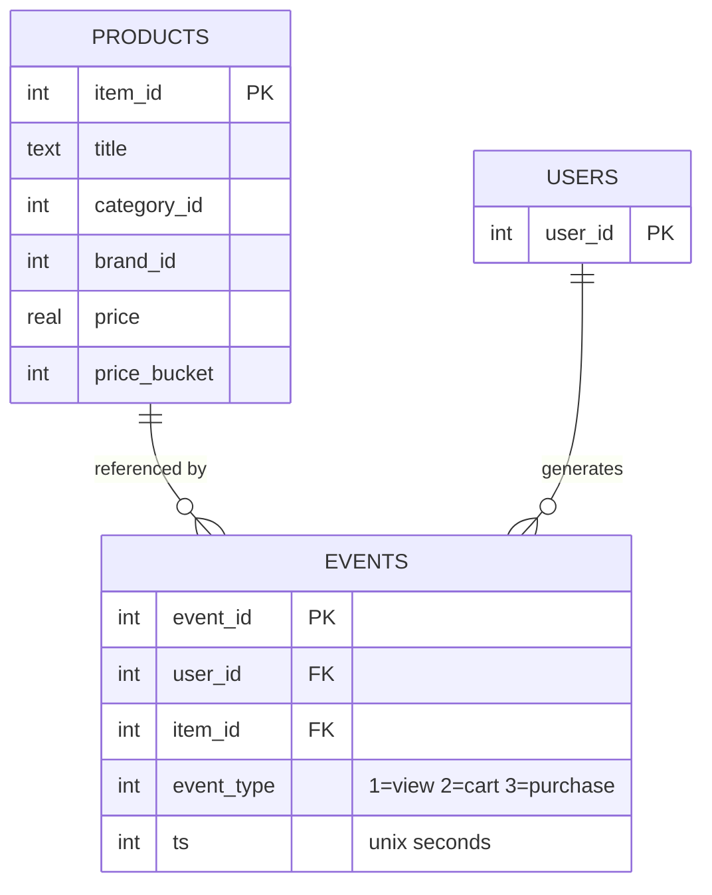
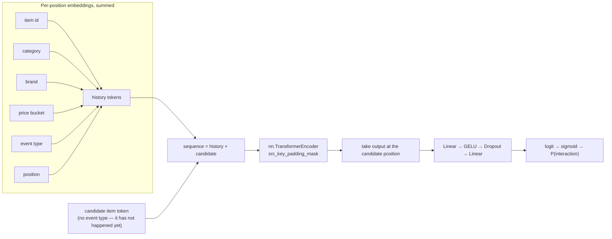

# Architecture

How recsys-lite is put together, and — just as importantly — what it
deliberately leaves out.

- [System shape](#system-shape)
- [Component reference](#component-reference)
- [The offline path](#the-offline-path)
- [The online path](#the-online-path)
  - [Model lifecycle](#model-lifecycle)
- [Data model](#data-model)
- [Model architecture](#model-architecture)
- [What stands in for what](#what-stands-in-for-what)
- [Design decisions and their trade-offs](#design-decisions-and-their-trade-offs)

---

## System shape

One Python process serves the API and the web console. One SQLite file is the
system of record. There is no message broker, no orchestrator, no separate
inference server, and no external cache.

The thing worth drawing is not the module list — it is **the loop, and the
delay inside it**. A shopper's action does not reach the recommender
immediately; it lands in an append-only log, and the serving-time feature
cache only picks it up when its 8-second TTL expires. That delay is the single
most surprising property of the system, so it is the one the diagram makes
visible.

*Figure 1 — the online loop (thin arrows) closes in seconds; the offline loop
(thick arrows) closes whenever someone retrains. The dotted arrow is where the
8s TTL sits: it is the only place in the system where fresh data waits.*

Two readings follow from that shape:

- **The UI cannot honestly show an instant update.** After an action the
  storefront waits ~9 s before re-querying, and says so, because the dotted
  arrow has not fired yet.
- **Both loops read the same table.** There is no separate analytics store, so
  a training row and a serving feature are derived from identical bytes —
  which is what makes point-in-time reconstruction trustworthy.

---

## Component reference

| Module | Responsibility | Notes |
|---|---|---|
| `constants.py` | Shared vocabulary sizes (item/category/brand/price-bucket/event) | Every embedding table is sized from here, so the generator can never emit an id the model cannot embed |
| `db.py` | SQLite schema, connections, reset | `PRAGMA foreign_keys = ON`; indexes on `(user_id, ts)` and `item_id` |
| `generator.py` | Synthetic catalog, shoppers, behaviour events | Per-shopper category preference and Pareto-ish activity skew, so the ranking problem is non-trivial |
| `features.py` | Point-in-time training rows | Temporal correctness + configurable hard-negative sampling |
| `online_store.py` | Serving-time features | In-memory, TTL-refreshed; read path is dict lookups |
| `dataset.py` | Torch `Dataset`, padding, temporal split | Split is by timestamp, never random |
| `model.py` | `RankingModel` | Built on `nn.TransformerEncoder` |
| `metrics.py` | ROC-AUC, NDCG@K, HitRate@K | numpy only, no scikit-learn |
| `drift.py` | Population Stability Index | Computed on request, not scheduled |
| `train.py` | Training CLI | Evaluates, registers, auto-promotes |
| `registry.py` | Model registry | `registry.json` + per-version checkpoint dirs |
| `serving/app.py` | HTTP surface | All routes; see [API.md](API.md) |
| `serving/ranking.py` | Scoring + Top-K | Builds one batch for the whole candidate pool |
| `serving/ab.py` | Traffic split | Stable hash of shopper id |
| `serving/observability.py` | `/metrics` | Prometheus text exposition |
| `web/` | Kestrel console | No build step, no dependencies |

---

## The offline path

Run explicitly, in order. Each stage writes an artifact the next one reads.

**1 — Generate.** Shoppers get a stable category preference; sessions escalate
view → cart → purchase with decaying probability; ~10% of shoppers are "power
users" producing a disproportionate share of events.

**2 — Build features.** For every cart/purchase event with at least
`min_history` prior interactions, emit one positive row whose history contains
**only events strictly before that event**, plus `negatives_per_positive`
negatives sharing the same history context. Half the negatives are drawn from
the positive's own category by default (`--hard-negative-fraction 0.5`).

**3 — Train.** Sort by timestamp, cut train/val/test, train with
`BCEWithLogitsLoss`, evaluate per epoch, keep the best-validation-NDCG@5
checkpoint, register it, and promote it to champion if it beats the incumbent.

Every artifact is reproducible from a seed. `features.py` also writes a
`sha256` of the JSONL so a model can be tied to the exact data it saw.

---

## The online path

One request to `/api/recommend/{user_id}` makes three decisions, and all three
are worth seeing: whether the feature cache is stale, which model variant
answers, and whether the shopper has any history at all.

*Figure 3 — the three `alt` blocks are the decisions. Everything else is
mechanical.*

Three properties this makes explicit:

- **One batch per request.** The whole candidate pool is a single forward pass,
  not one call per item.
- **A/B assignment is a hash, not a coin flip.** The same shopper always gets
  the same variant, so their experience stays coherent across requests.
- **Cold start is a branch, not a failure.** An unknown shopper gets a
  popularity pool and an all-padding sequence, and the model scores it — see
  the caveat about score *comparability* in
  [README.md](../README.md#known-limitations).

### Model lifecycle

Promotion is the one place where a training run changes what production serves,
so the states are worth naming.

*Figure 4 — a losing model is kept, not discarded. `superseded --> champion`
exists but is manual: there is no rollback UI, only editing `registry.json`.*

---

## Data model

`events` is append-only. Nothing in the system updates or deletes a row, which
is what makes point-in-time reconstruction honest: replaying the log at any
timestamp yields exactly the state the model would have seen.

---

## Model architecture

`RankingModel` scores one **(shopper history, candidate item)** pair.

The idea of appending the candidate to the behaviour sequence and letting
self-attention relate them comes from the Behavior Sequence Transformer
literature ([Chen et al., 2019](https://arxiv.org/abs/1905.06874)). The
implementation is original and uses PyTorch's stock encoder — see
[../THIRD_PARTY.md](../THIRD_PARTY.md).

**Cold start is a real path, not a special case.** A shopper with no history
arrives as an all-padding sequence. `src_key_padding_mask` masks it out and
the model scores on candidate attributes alone. See the honest caveat about
cold-start score *calibration* in [../README.md](../README.md#known-limitations).

---

## What stands in for what

This is a vertical slice. Each row is a deliberate substitution, not an
oversight.

| In this repo | Stands in for | Consciously omitted |
|---|---|---|
| SQLite | Operational Postgres | Replication, CDC |
| `generator.py` | A live storefront's traffic | Kafka / Debezium |
| `features.py` | Spark or dbt batch jobs | Distributed compute, a warehouse |
| `online_store.py` (TTL dict) | Feast + Redis | Streaming materialisation |
| `registry.py` (JSON + files) | MLflow tracking + registry | A tracking server, artifact store |
| `serving/app.py` | Feature API + inference API + gateway | Kubernetes, Triton, service mesh |
| `serving/ab.py` | Progressive rollout controller | Shadow traffic, automatic rollback |
| `/metrics` | Prometheus + Grafana | A scraper and dashboards |
| `drift.py` on request | Evidently on a schedule | A scheduler |

---

## Design decisions and their trade-offs

**SQLite as the system of record.** Zero setup, and the whole database is one
file you can copy. Costs: one writer at a time, and `online_store.py` reloads
in full rather than incrementally. Fine at this scale; wrong past it.

**TTL cache instead of streaming materialisation.** A dict rebuilt every 8s is
~20 lines and easy to reason about. It means a shopper's action is not visible
to the recommender for up to 8 seconds — the UI states this rather than hiding
it.

**No build step for the frontend.** Plain ES modules mean the console is
editable with any text editor and has no `node_modules`, no bundler and no
supply chain. Costs: no JSX, no tree-shaking, manual DOM work.

**Hard negatives on by default.** Uniform-random negatives are mostly trivial
and inflate offline metrics. Sampling half from the positive's own category
makes the numbers less flattering and more honest — the effect is measured in
the README.

**Model scores user → item only.** "Similar products" on the product page is a
content-based lookup (same category, nearest price), not a model call, because
this model has no item→item notion. Dressing it up as ML would misrepresent
what it does.

---

## Related documents

- [BUSINESS-FLOW.md](BUSINESS-FLOW.md) — the end-to-end journeys
- [AUTHORIZATION.md](AUTHORIZATION.md) — trust boundary today, proposed role model
- [API.md](API.md) — endpoint reference
- [DESIGN-SYSTEM.md](DESIGN-SYSTEM.md) — UI tokens and rules
- [DEVELOPMENT.md](DEVELOPMENT.md) — running and extending it
