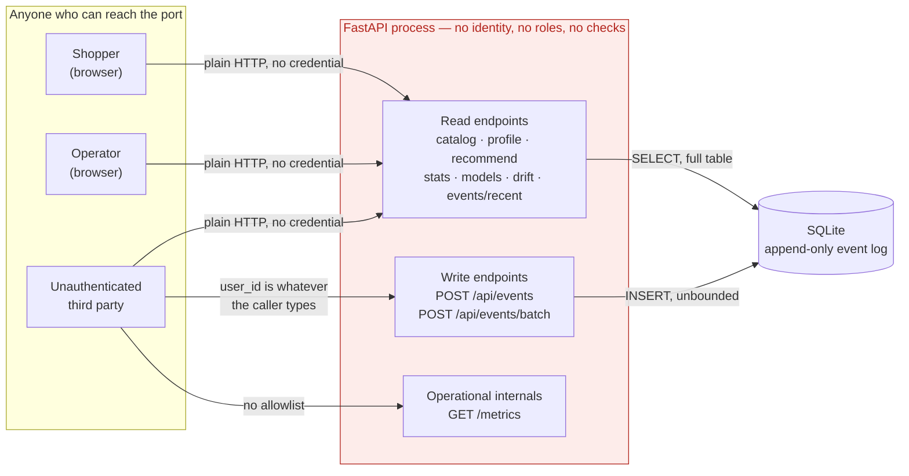
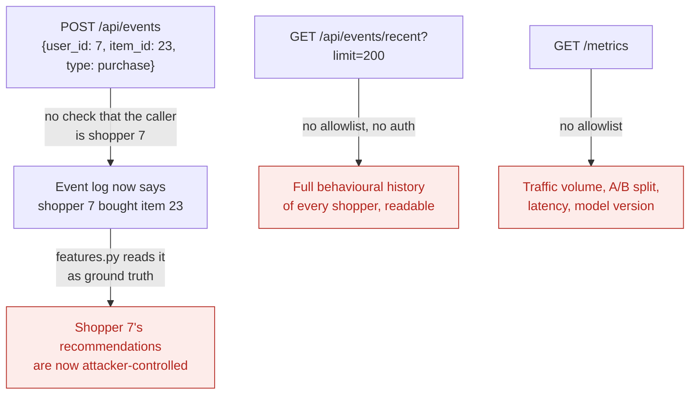
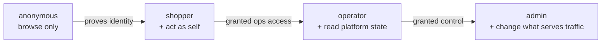
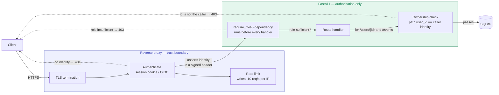

# Authorization model

> **Current state, stated plainly: this application performs no
> authentication and no authorization.** Every endpoint is reachable, without
> credentials, by anyone who can open a socket to the port. The first half of
> this document draws what that actually means. The second half is a
> **proposed** model that is **not implemented** — it exists so the boundary
> has a design to be built against, and every diagram in it is labelled as
> such.

- [Actors](#actors)
- [What the trust boundary looks like today](#what-the-trust-boundary-looks-like-today)
- [Three abuse paths this opens](#three-abuse-paths-this-opens)
- [Endpoint exposure today](#endpoint-exposure-today)
- [Proposed model (not implemented)](#proposed-model-not-implemented)
- [Proposed role matrix](#proposed-role-matrix)
- [Where each check would live](#where-each-check-would-live)
- [What to do until then](#what-to-do-until-then)

---

## Actors

| Actor | Reaches the system via | Wants to |
|---|---|---|
| **Shopper** | Kestrel shop routes | Browse, add to cart, check out |
| **Operator** | Kestrel operations routes | See platform health, models, drift, raw events |
| **ML engineer** | CLI on the host | Regenerate data, retrain, promote |
| **Unauthenticated third party** | The open port | — whatever they like, today |

The "Browsing as" selector in the sidebar switches shopper identity by
changing a number in a dropdown. It is a demo affordance, **not a login**, and
nothing server-side verifies it.

---

## What the trust boundary looks like today

There is exactly one boundary — the network edge — and nothing behind it.

*Figure 1 — every arrow above crosses the only boundary that exists. Inside
the process there is no second gate: the same code path serves a shopper, an
operator and a stranger identically.*

The consequence worth internalising: **the application cannot tell these three
actors apart.** Not "it authorises them permissively" — it has no concept of
who is calling at all.

---

## Three abuse paths this opens

These are not hypothetical; they follow directly from Figure 1.

*Figure 2 — identity spoofing, history disclosure and internals disclosure.
The first is the most interesting: because the event log is the training
signal, writing to it is not just data pollution — it is model manipulation.*

None of these are vulnerabilities to report. They are the documented
consequence of a demo with no auth layer, and
[SECURITY.md](../SECURITY.md#what-is-out-of-scope) lists them as out of scope
for exactly that reason.

---

## Endpoint exposure today

All 15 endpoints, and what each hands to an unauthenticated caller.

| Endpoint | Method | Exposes today |
|---|---|---|
| `/health` | GET | Champion version, catalog and shopper counts |
| `/metrics` | GET | Traffic volume, A/B split, latency percentiles |
| `/api/catalog` | GET | Whole product catalog |
| `/api/categories` | GET | Category list and sizes |
| `/api/products/{id}` | GET | One product |
| `/api/similar/{id}` | GET | Content-based neighbours |
| `/api/users` | GET | Enumerable shopper ids |
| `/api/users/{id}/profile` | GET | **Any** shopper's interaction count and inferred preferences |
| `/api/recommend/{id}` | GET | **Any** shopper's personalised recommendations |
| `/api/events` | POST | **Write** an event as **any** shopper |
| `/api/events/batch` | POST | **Write** up to 100 events as **any** shopper |
| `/api/events/recent` | GET | Raw behavioural log across all shoppers |
| `/api/stats` | GET | Platform-wide counters |
| `/api/models` | GET | Model versions and training metrics |
| `/api/drift` | GET | Feature distribution statistics |

The rows in bold are the ones a real deployment cannot leave open.

---

## Proposed model (not implemented)

> ⚠️ **Nothing below exists in the codebase.** It is a design for the boundary,
> written so that adding auth later is a matter of implementing a known shape
> rather than inventing one under pressure.

Four roles, each a strict superset of the one before it:

*Figure 3 — role ladder. Each step adds capability; none removes any.*

The mechanism that matters is **where identity enters and where the decision
is made** — those are two different places, and conflating them is the usual
mistake:

*Figure 4 — proposed. Authentication happens once at the edge; authorization
happens per-route inside the app. The app never re-authenticates — it trusts
the identity the proxy asserts, which is why that header must be stripped from
inbound requests and re-set by the proxy, never passed through.*

The `ownercheck` node is the part that fixes abuse path 1 in Figure 2: it is
not enough to know the caller is *a* shopper; a write to
`/api/events` must assert that `user_id` **is** the caller.

---

## Proposed role matrix

| Endpoint | anonymous | shopper | operator | admin |
|---|:--:|:--:|:--:|:--:|
| `GET /health` | ✅ | ✅ | ✅ | ✅ |
| `GET /api/catalog` | ✅ | ✅ | ✅ | ✅ |
| `GET /api/categories` | ✅ | ✅ | ✅ | ✅ |
| `GET /api/products/{id}` | ✅ | ✅ | ✅ | ✅ |
| `GET /api/similar/{id}` | ✅ | ✅ | ✅ | ✅ |
| `GET /api/recommend/{id}` | ❌ | **self only** | ✅ | ✅ |
| `GET /api/users/{id}/profile` | ❌ | **self only** | ✅ | ✅ |
| `POST /api/events` | ❌ | **self only** | ❌ | ✅ |
| `POST /api/events/batch` | ❌ | **self only** | ❌ | ✅ |
| `GET /api/users` | ❌ | ❌ | ✅ | ✅ |
| `GET /api/events/recent` | ❌ | ❌ | ✅ | ✅ |
| `GET /api/stats` | ❌ | ❌ | ✅ | ✅ |
| `GET /api/models` | ❌ | ❌ | ✅ | ✅ |
| `GET /api/drift` | ❌ | ❌ | ✅ | ✅ |
| `GET /metrics` | ❌ | ❌ | ✅ | ✅ |
| *promote/rollback a model* | ❌ | ❌ | ❌ | ✅ |

**self only** means the `{id}` in the path must equal the caller's own
identity — a role check alone is insufficient.

Two deliberate choices in that table:

- **Operators cannot write events.** Read-only by default keeps an operator
  session from polluting the training signal, deliberately or by accident.
- **Anonymous can still browse the catalog.** A storefront that demands login
  to see products is a worse storefront; the boundary belongs at
  personalisation, not at the product list.

---

## Where each check would live

| Concern | Belongs at | Why not elsewhere |
|---|---|---|
| TLS | Proxy | The app should never hold a private key |
| Authentication | Proxy | One implementation, not one per service |
| Rate limiting | Proxy | Must reject before the app spends work |
| Role check | App (`require_role` dependency) | The app owns the meaning of its roles |
| Ownership check | App (per handler) | Only the handler knows which path param is an identity |
| Audit of writes | App | The proxy cannot see which row was written |

Splitting it this way means the app stays deployable behind any proxy that can
assert an identity, and the proxy stays ignorant of what the roles mean.

---

## What to do until then

The gap is real, so the mitigation has to be operational rather than
architectural:

1. **Bind to `127.0.0.1`** and never publish the port directly.
2. **Put an authenticating reverse proxy in front** — the nginx example in
   [DEPLOYMENT.md](DEPLOYMENT.md#behind-a-reverse-proxy) covers basic auth,
   write rate limiting and restricting `/metrics` to a monitoring network.
3. **Treat the event log as untrusted** if the instance was ever reachable.
   Anything written through the open endpoint is indistinguishable from real
   behaviour, and it has already been folded into whatever model was trained
   afterwards.
4. **Do not put real personal data in it.** The shopper ids are integers over
   synthetic data; nothing in the schema is designed to hold anything else.

Related: [SECURITY.md](../SECURITY.md) ·
[DEPLOYMENT.md](DEPLOYMENT.md#production-gaps) ·
[ARCHITECTURE.md](ARCHITECTURE.md#what-stands-in-for-what)
