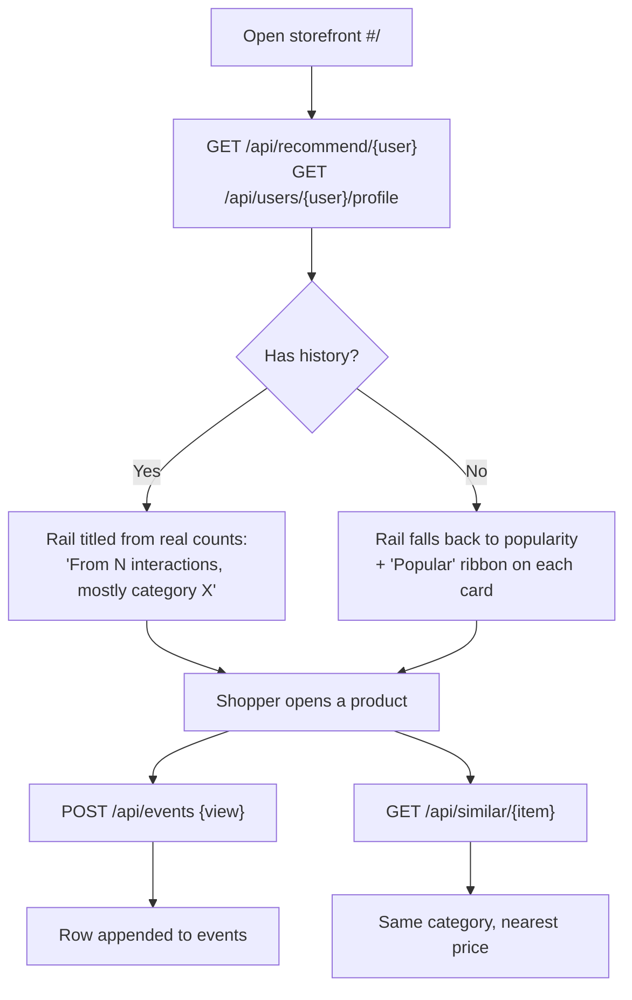
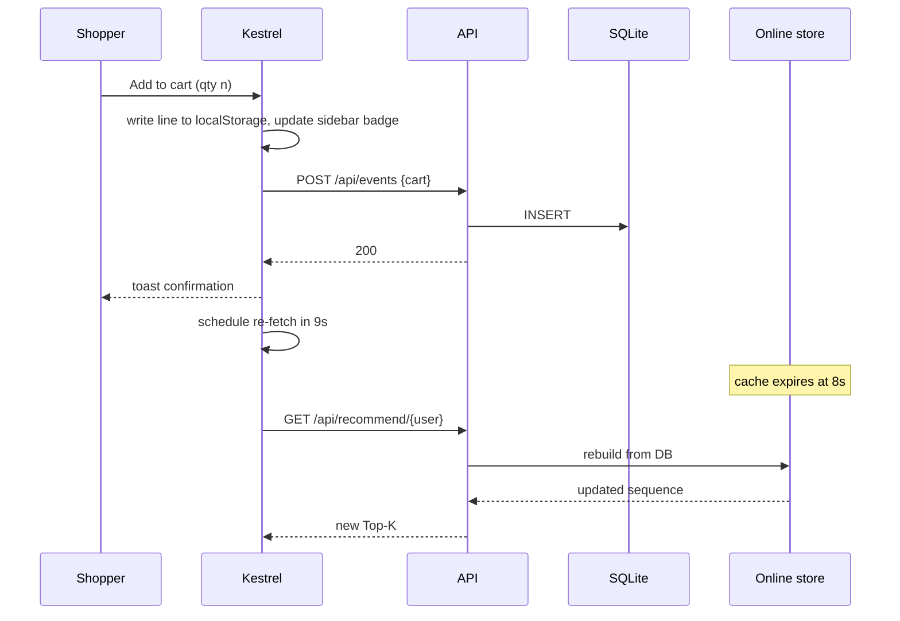
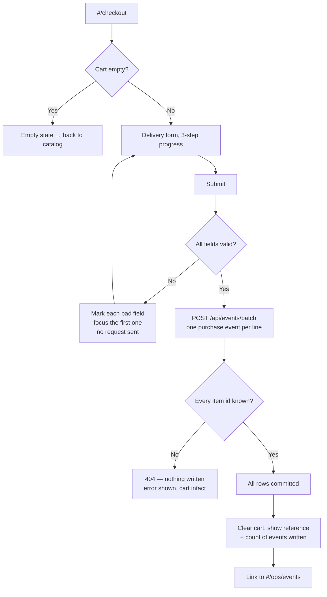
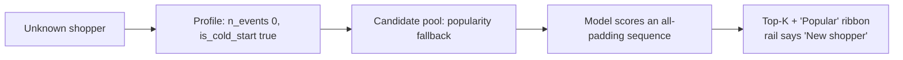
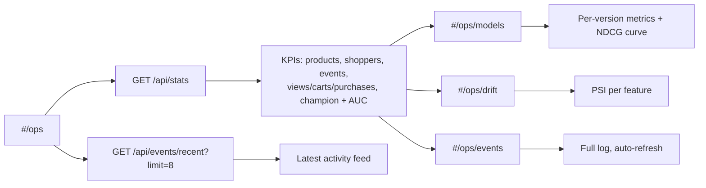
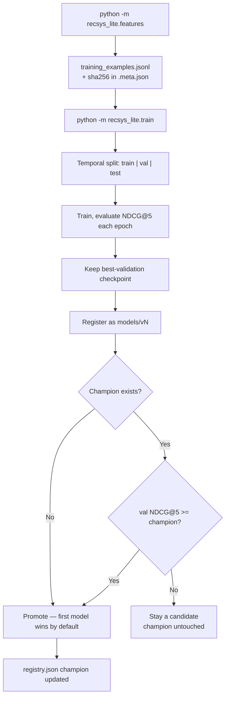
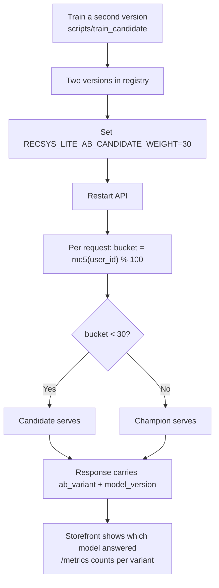
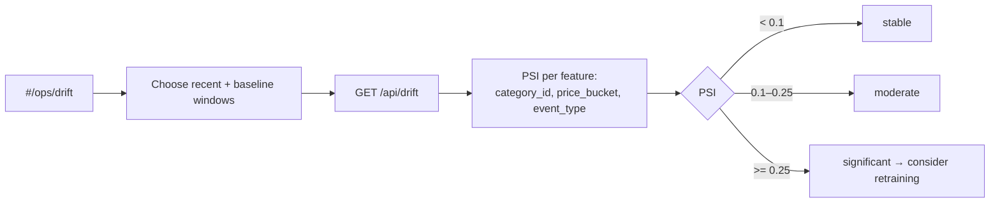

# Business flows

What actually happens, step by step, for each thing a person can do in
Kestrel — and what the system records as a result.

- [Actors](#actors)
- [Flow 1 — Shopper discovers a product](#flow-1--shopper-discovers-a-product)
- [Flow 2 — Add to cart](#flow-2--add-to-cart)
- [Flow 3 — Checkout and order confirmation](#flow-3--checkout-and-order-confirmation)
- [Flow 4 — Cold-start shopper](#flow-4--cold-start-shopper)
- [Flow 5 — Operator inspects the platform](#flow-5--operator-inspects-the-platform)
- [Flow 6 — Retraining and promotion](#flow-6--retraining-and-promotion)
- [Flow 7 — A/B rollout of a candidate model](#flow-7--ab-rollout-of-a-candidate-model)
- [Flow 8 — Drift investigation](#flow-8--drift-investigation)
- [Event semantics](#event-semantics)
- [State that survives a reload](#state-that-survives-a-reload)

---

## Actors

| Actor | Uses | Goal |
|---|---|---|
| **Shopper** | Shop routes (`#/`, `#/catalog`, `#/product/:id`, `#/cart`, `#/checkout`) | Find something worth buying |
| **Operator** | Operations routes (`#/ops`, `#/ops/models`, `#/ops/drift`, `#/ops/events`) | Know whether the recommender is healthy and which model is serving |
| **ML engineer** | CLIs (`generator`, `features`, `train`) | Rebuild data, retrain, promote |

There is no authentication. The "Browsing as" selector in the sidebar swaps
shopper identity directly — it is a demo affordance, not a login. See
[SECURITY.md](../SECURITY.md).

---

## Flow 1 — Shopper discovers a product

**Trigger:** shopper lands on `#/` or clicks a product.

**Steps**

1. The storefront requests recommendations and the shopper profile in parallel.
2. Each card shows a **match bar** — the model's sigmoid output for that
   (shopper, item) pair — plus the serving model version and A/B variant.
3. Opening a product fires a `view` event before the page finishes rendering.
   The request is fire-and-forget: a dropped analytics event must never break
   a product page.
4. "Similar products" is a content lookup, not a model call — the panel says so.

**Outcome:** one `view` row. The shopper's sequence and preferred categories
shift on the next TTL refresh.

---

## Flow 2 — Add to cart

**Why the 9-second wait:** the online feature store refreshes on an 8s TTL. The
UI waits just past it, and only re-fetches if the shopper is still on the
storefront. This latency is stated in the interface rather than hidden behind
a fake instant update.

**Cart quantity is client state.** It lives in `localStorage`, not the
database. One `cart` event is written per add action regardless of quantity —
the model treats events as interactions, not units.

---

## Flow 3 — Checkout and order confirmation

**The all-or-nothing rule.** `/api/events/batch` validates **every** item id
before inserting **any** row. A checkout can never half-record. This is
covered by a test that submits one good line and one bad line and asserts the
shopper's event count is unchanged
(`test_event_batch_rejects_the_whole_order_if_any_item_is_unknown`).

**Validation is per-field.** Each invalid input gets `aria-invalid`, a red
border and its own message; focus moves to the first offender. No single
generic banner.

**Nothing is charged and nothing ships.** The confirmation screen says so, and
so does the pre-submit notice. The order reference is display-only — no orders
table exists.

**Outcome:** one `purchase` row per distinct product. These are the strongest
positive signal `features.py` trains on.

---

## Flow 4 — Cold-start shopper

Pick the last entry in "Browsing as" — a shopper id with no history.

The model handles this natively — `src_key_padding_mask` masks the empty
history and scoring proceeds on candidate attributes alone.

> **Known limitation.** Cold-start scores cluster near 1.0 while a shopper with
> history sees scores near 0.1. *Ordering* within each case is meaningful;
> absolute scores are **not comparable across the two**. Do not threshold on
> raw score. Root cause and fix are in
> [README.md](../README.md#known-limitations).

---

## Flow 5 — Operator inspects the platform

Everything on these pages is read live from the same database the storefront
writes to. Open the storefront in one tab and `#/ops/events` with auto-refresh
in another to watch rows appear as you shop.

---

## Flow 6 — Retraining and promotion

**Promotion is automatic but conditional**, on validation NDCG@5 — never on
test, which stays held out. A model that loses is still registered so it can
be A/B tested or inspected; it simply does not take traffic by default.

Restarting the API picks up the new champion (the router is built at startup).

---

## Flow 7 — A/B rollout of a candidate model

**Assignment is sticky** — a hash of the shopper id, not a coin flip — so a
given shopper always sees the same variant and their experience stays
coherent. Verified by test and measured live: 100 shoppers at weight 30 split
69/31.

**What is deliberately missing:** shadow traffic, automatic rollback on metric
regression, and sequential testing. Those belong to a rollout controller this
project does not pretend to have.

---

## Flow 8 — Drift investigation

PSI compares a recent window against an earlier baseline window of raw events.
If either window is empty the report says so instead of returning a
meaningless number.

Stationary synthetic data usually reports *stable* — that is the correct
answer, not a placeholder. The detector's correctness is proven independently
by a unit test that constructs a deliberate category shift and asserts
*significant*.

---

## Event semantics

| Type | Code | Written when | Meaning for the model |
|---|---|---|---|
| `view` | 1 | A product detail page opens | Weak interest |
| `cart` | 2 | Add to cart, anywhere | Strong interest — a training positive |
| `purchase` | 3 | Checkout submitted, one per line | Strongest — a training positive |

`features.py` treats `cart` and `purchase` as positives. `view` events shape
the behaviour sequence but never become labels.

**Invariant:** a training row's history contains only events **strictly
before** the event that produced it. Enforced by construction and asserted by
`test_training_example_history_never_includes_the_triggering_event_or_future_events`.

---

## State that survives a reload

| State | Where | Lifetime |
|---|---|---|
| Cart lines | `localStorage.kestrel_cart` | Until cleared or checked out |
| Selected shopper | `localStorage.kestrel_user` | Until changed |
| Theme | `localStorage.kestrel_theme` | Until changed |
| Events | SQLite `events` | Permanent, append-only |
| Models | `models/vN/` + `registry.json` | Permanent |
| Online features | Process memory | 8 seconds |

Nothing personal is stored. Shopper ids are integers over synthetic data, and
the checkout form is never transmitted anywhere — only the `purchase` events
are.
